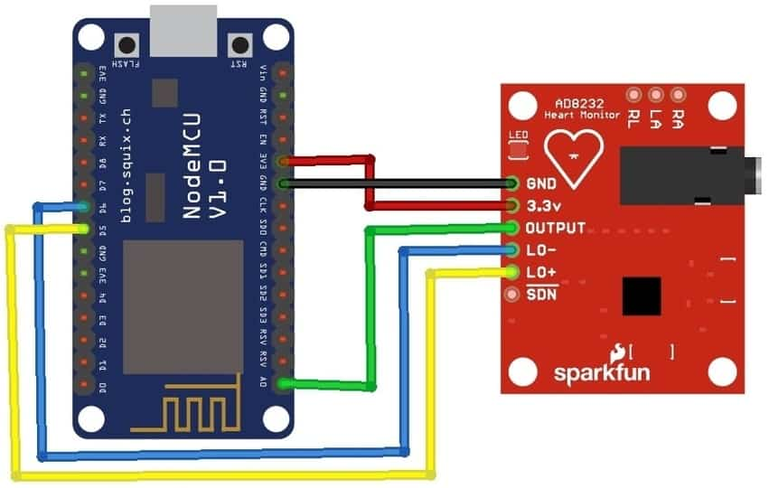

# ECG / EKG monitor with WiFi Logging

Uses a red AD3232 ECG board on an ESP8266.

Following [how2electronics.com's guide](https://how2electronics.com/iot-ecg-monitoring-ad8232-ecg-sensor-esp8266/#Circuit_Diagram_Interfacing_AD8232_ECG_Sensor_with_NodeMCU_ESP8266), it is
presently coded to use pin mapping (Board - NodeMCU(ESP8266)):

1. GND - GND
1. 3.3v - 3.3v
1. Output - A0
1. LO- - D4
1. LO+ - D5
1. SDN - Not Connected

