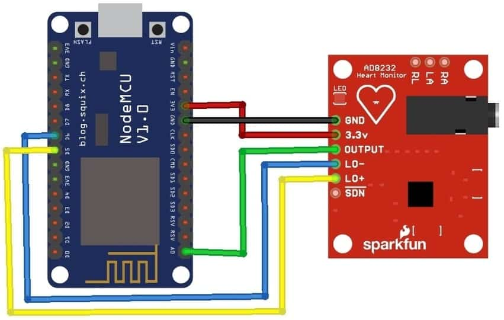
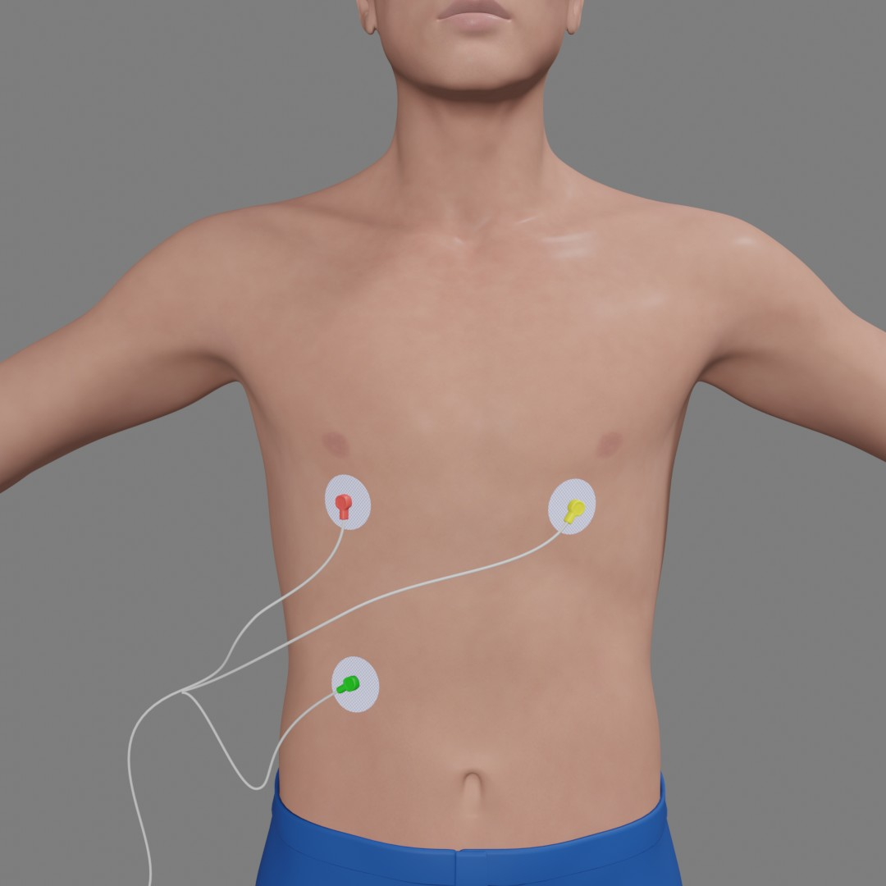
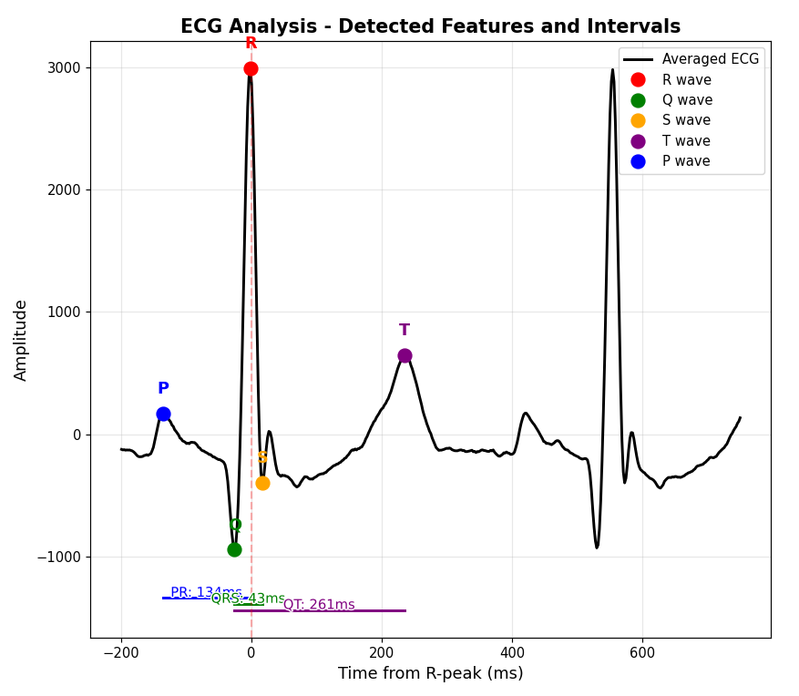
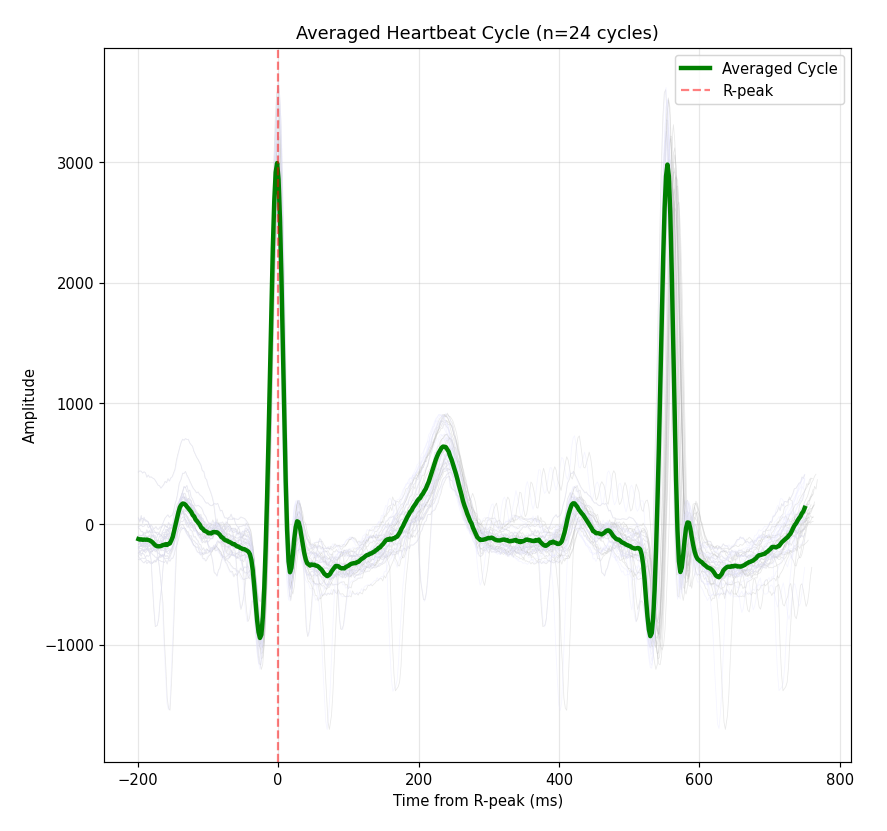
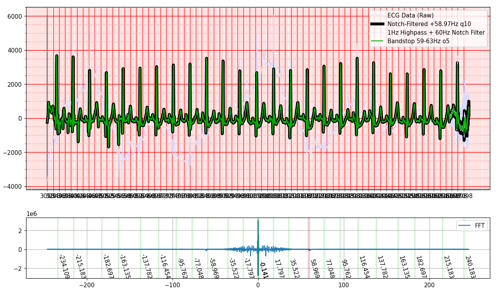

# ECG / EKG monitor with WiFi Logging

[https://github.com/jaggzh/ecg-wifi-ad8232-esp8266.git](https://github.com/jaggzh/ecg-wifi-ad8232-esp8266)

This project currently uses a red AD3232 ECG board (Sparkfun or clone) on an ESP8266. My `server-tcp/server_cbs` is a nice fast .c server that receives the optimized packets of ECG data and logs them. It supports the use of a button on the ECG device which lets you start and mark events, switching to a new logfile so you can have your events separated. This also makes it easier to have nice "small" logs just for events. This also lets you, much easier, run `plot-utils/ecg-plot-and-analyze` on a specific log file:

## See our [New Analysis and Really Clean Averaging](#analysis-of-cycles)

Following [how2electronics.com's guide](https://how2electronics.com/iot-ecg-monitoring-ad8232-ecg-sensor-esp8266/#Circuit_Diagram_Interfacing_AD8232_ECG_Sensor_with_NodeMCU_ESP8266), it is
presently coded to use pin mapping (Board - NodeMCU(ESP8266)):

1. GND - GND
1. 3.3v - 3.3v
1. Output - A0
1. LO- - D2
1. LO+ - D5
1. SDN - D7

1. External LED - D1
1. Button       - D6





# Analysis of cycles

I recorded an event. With the timestamp in the filename, `ecg-plot-and-analyze` picks the *"template"*cycle and aligns other similar cycles to it to form a really nice clean averaged cycle.

The command I ran -- I just pointed it at the log file, and told it to perform an analysis. I took screen-captures of the 3 windows that popped up.

```bash
ecg-wifi-ad8232-esp8266/plot-utils/ecg-plot-and-analyze -f 'path/to/tcpserver_data/2025-04-17--21:30PM-chest-pain' -A --align-cross-correlation
```

<div align="center">
  <em>Plot: Averaged cycle with analysis</em><br>
  <br>
</div>

<div align="center">
  <em>Plot: Averaged cycle</em><br>
  <br>
</div>

<div align="center">
  <em>The log snippet of the event</em><br>
  <br>
</div>


## Usage

1. Copy and edit wifi\_config--example.h to wifi\_config.h
1. In server-tcp/, copy settings-example.h to settings.h


